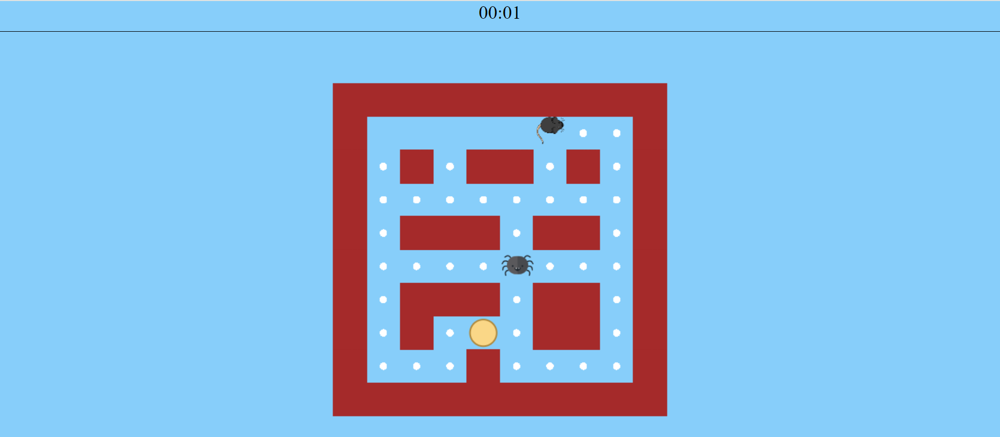

# Running Mike
## Installation
#### 1. Clone the repository
```bash
 git clone httpsgithub.comChausVeraRunning-Mike
```
#### 2. Run menu.html on Windows
```bash
 start menu.html
```
 Run menu.html on Linux
```bash
xdg-open menu.html
```
 Run menu.html on macOS
```bash
 open menu.html
```
## Usage
Runng Mike is an action maze chase video game

The goal of the game is to collect all crumbles. There are three skins and 2 levels of complexity. Avoid venomous spiders or beat them with cracker superpower. Try your best and set a new record!

